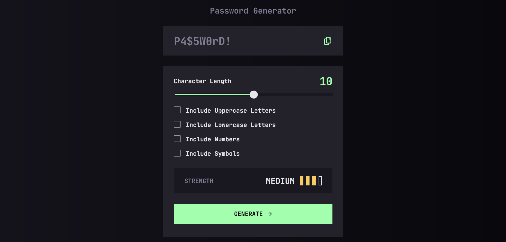

# Frontend Mentor - Password generator app solution

This is a solution to the [Password generator app challenge on Frontend Mentor](https://www.frontendmentor.io/challenges/password-generator-app-Mr8CLycqjh).

## Table of contents

- [Overview](#overview)
  - [The challenge](#the-challenge)
  - [Screenshot](#screenshot)
  - [Links](#links)
- [My process](#my-process)
  - [Built with](#built-with)
  - [What I learned](#what-i-learned)
  - [Continued development](#continued-development)
  - [Useful resources](#useful-resources)
- [Author](#author)
- [Acknowledgments](#acknowledgments)

## Overview

### The challenge

Users should be able to:

- Generate a password based on the selected inclusion options
- Copy the generated password to the computer's clipboard
- See a strength rating for their generated password
- View the optimal layout for the interface depending on their device's screen size
- See hover and focus states for all interactive elements on the page

### Screenshot

### Links

- Solution URL: [Github](https://github.com/kaamiik/fm-password-generator-app)
- Live Site URL: [Vercel](https://fm-password-generator-app-jet.vercel.app/)

## My process

### Built with

- Semantic HTML5 markup
- CSS custom properties
- Flexbox
- Mobile-first workflow
- Sass
- Cube CSS
- Vite
- Accessibility

### What I learned

- On the html part, I've used `<output>` tag for different parts.
- On the css I've learned how to style Range Slider and checkboxes to run properly on all browsers.
- On the JS, evaluate strength and generate password was really challenging.

### Useful resources

- [Help me how to Generate password](https://www.mbloging.com/post/password-generator-how-to-generate-passwords-using-javascript)
- [How to copy text to clipboard with JS](https://www.freecodecamp.org/news/copy-text-to-clipboard-javascript/)
- [How to generate pure CSS checkbox](https://moderncss.dev/pure-css-custom-checkbox-style/)
- [How to generate range input slider](https://www.smashingmagazine.com/2021/12/create-custom-range-input-consistent-browsers/)

## Author

- Frontend Mentor - [@kaamiik](https://www.frontendmentor.io/profile/kaamiik)
- Twitter - [@kiaakamran](https://www.twitter.com/kiaakamran)
